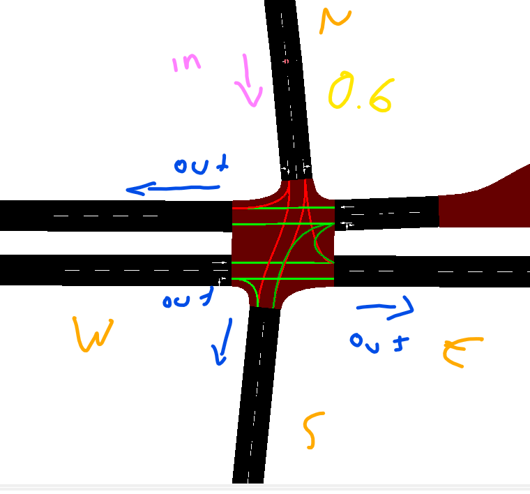

## 12 Feb 2021
Se modificaron las funciones de generacion y se agregó manera de obtener datos
para grafica sobre el tiempo.

### Notas
Un histograma sirve para representar frecuencia de valores representados. No
representa una graficacion de la funcion sobre el tiempo o algo por el estilo.

```python
import traffic_generator as tg
import matplotlib.pyplot as plt
import numpy as np

t = tg.intervalToSeconds('12:30', '15:30')
probspeak = tg.genPeakProbs(t, "medium")
h = plt.hist(probspeak, bins=200,
             density=True)
plt.show()
```

Si se quiere saber la grafica sobre el tiempo, se requiere un eje *x* que sean
numeros contiguos [0, 1, 2, 3, 4, ...].

```python
probspeakgraph = tg.genPeakProbs(t, 'medium', graphmode=True)
plt.plot(probspeakgraph['x'], probspeakgraph['y'])
```

## 10 Feb 2021
Se creó un método para generar tráfico que va desde una intersección y se
divide en otras intersecciones según probabilidades iguales o personalizadas.




## 2 Feb 2021
+ Tengo una arquitectura corriendo que controla un semaforo.
+ Registra densidad, flujo, direccion, etc.
+ Recibe datos sobre en que iterseccion le llega trafico proveniente de otro
+ semaforo.
+ Es capaz de predecir en que interseccion le llegará tráfico?
+ Como actuará con los hechos que ya sabe que pasarán?
+ Para que se usarán las redes de petri? Creo que estarían chidas para comunicar
  datos entre semaforos

Si le aplico Reinforment Learning, puedo tratar de optimizar cosas, como
maximizar el flujo y minimizar la densidad de tráfico.


1. Identificar horas pico.
2. En dichas horas, identificar de que intersecciones viene el tráfico.
3. Sabiendo de que intersecciones viene, aplicar RL para optimizar la
   circulación para esas intersecciones.
4. Cuando se sepa que viene un flujo de tráfico de una intersección adyacente, optimizar para esa intersección.
5. Cuando halla tráfico disperso, optimizar de manera genérica para todas las
   intersecciones o tener una política estática fija.

+ Para horas pico: clustering.
  + Se organizará la información por día, y se hallarán los intervalos de tiempo
    de dichas horas de acuerdo a los datos de los reportes.
+ Para saber de donde viene la mayor cantidad de tráfico, simplemente ordenar
  por densidad las calles.
+ Para optimizar, Reinforment Learning


## 1 Feb 2021
Flow es un framework que permite usar la librería para *Reinforment Learning*
RLlib en conjunto con diversas herramientas para facilitar crear entornos de
simulación usando como simuladores de tráfico a SUMO y Aimsun. Entre los dos, el
mejor soportado es el primero. El *RL* se puede usar tanto para conducción
autónoma, como para controlar los semáforos. Para ello, se puede utilizar como
backend a Tensorflow o Pythorch, aunque se promete que la mayoría de las
funciones son agnósticas a los frameworks de *Machine Learning*.

### Ventajas
Leí la documentación del framework Flow, y posee las siguientes herramientas que
directamente me pueden ser útiles:

+ Incluye redes de tráfico pensadas para hacer pruebas, como uno que es una
  matriz de semáforos, otro que simula un cuello de botella y otra que es una
  mini-ciudad.

+ Las redes de tráfico reciben parámetros vía python para configurarlas, en
  lugar de tener que manipualr directamente los archivos xml.

+ Los vehículos se pueden controlar usando la manera nativa de SUMO, o usando
  controladores y enrutadores incluidos en el framework, como el 
  *Intelligent Driver Model* o el *Continuos Router* (para mantener al tráfico
  dentro de la simulación y que no salga).

+ Tiene su propia manera de importar redes de tráfico de Open Street Maps.

+ Es posible usar las ventajas del framework sin necesidad de usar las partes de
  *RL*.

+ Guarda los resultados del experimento en un directorio en diversos tipos de
  archivos (algunos son csv) y posteriormente se pueden visualizar con
  *Tensorboard* para comparar resultados entre diversas ejecuciones en una misma
  gráfica.

### Posibles desventajas

+ No poder integrar la generación de tráfico ya desarrollada.

+ No poder integrar el control de semáforos usando redes de Petri.

+ No poder acoplar mi módulo de recolección de datos en una base de datos.

### Acercamiento

Terminaré la simulación de un día completo en una intersección sin Flow,
recopilaré datos necesarios, y posteriormente intentaré replicarlo en Flow para
ahora si saber a ciencia cierta si le puedo acoplar las partes de mi
arquitectura. De no ser así, no es el fin del mundo, lo que haré es hacerlo de
la manera que Flow dicta, y trataré de hallar métricas que pueda recopilar en
ambas maneras que me permitan hacer un versus justo entre ambos acercamientos.

