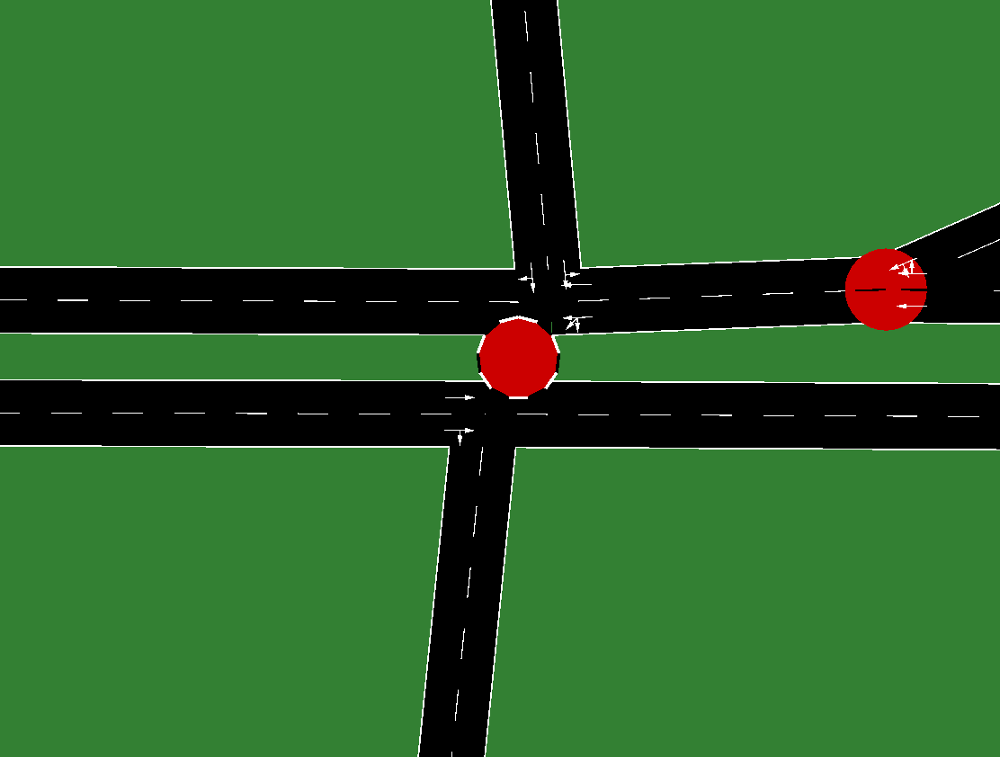

Situación: un día normal en la intersección de Cinco Colonias

Hora 0: 0 horas (en formato de 24 horas).

Condiciones de tráfico:

### 0 - 5:30 Tráfico esporádico de la madrugada
Trafico constante muy esporádico en todas las direcciones
EW: 
WE: 
NS: 

### 5:30 - 8:30 Salidas a escuela y trabajo
EW: tráfico en campana, hasta alcanzar un pico a las 7:30.
WE: tráfico medio
NS: tráfico medio

### 8:30 - 12:30
EW: tráfico medio
WE: tráfico medio
NS: tráfico medio

### 12:30 - 15:30 Salidas de escuela y salida-regreso del trabajo para la comida
EW: tráfico en campana, pero no tanto como en la mañana, hasta alcanzar un pico a las 15.
WE: tráfico en campana, pero no tanto como en la mañana, hasta alcanzar un pico a las 14.
NS: tráfico en campana, pero no tanto como en la mañana, hasta alcanzar un pico a las 14.

### 15:30 - 18:30

### 18:30 - 21:30 Regreso del trabajo
EW: Tráfico en campana, con pico a las 19:30 
WE: tráfico medio
NS: Tráfico en campana, con pico a las 19:30 

### 21:30 - 23
Tráfico medio constante
EW: 
WE: 
NS: 

### 23 - 0
Trafico constante muy esporádico en todas las direcciones
EW: 
WE: 
NS: 

