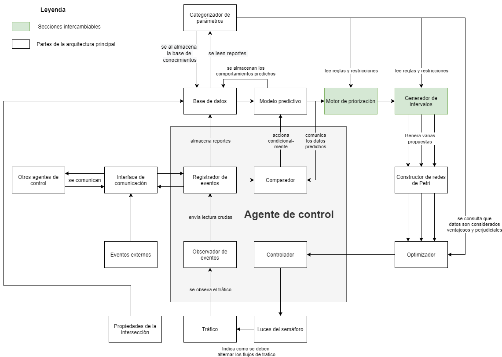

# Propuesta de Arquitectura
<!--  -->
\includegraphics[width=\textwidth]{arquitectura.png}
Fig. 1: Arquitectura de un agente de control.

## Tráfico
Los vehículos que se mueven en los carriles de la intersección y cruzan de un carril a otro en nodos llamados intersecciones.  Sobre las intersecciónes puede haber ubicados semáforos.

## Propiedades de la intersección
Son las propiedades intrínsecas de la intersección que no suelen cambiar con el paso del tiempo:

+ Número de calles.
+ Carriles en cada calle.
+ Extensión aproximada de cada carril.
+ Estructura de la intersección: todas las posibles conexiones entre carriles.
+ Derechos y prioridades de paso.
+ Disposición de las luces del semáforo (cuántas hay y a que intersección apuntan).
+ Existencia de cruces y puentes peatonales, y si tienen algún botón que permita detener el tráfico.

## Observador de eventos
Su única tarea es ser el sentido de la vista del agente de control.
Tiene funciones para observar eventos de interés que suceden con regularidad en el mundo real en un momento dado y sus propiedades, tales como:

+ El paso de los vehículos, con propiedades como:
  + Ruta que toma (pueden seguir derecho o girar en algún sentido).
  + Velocidad promedio aproximada.
  + Cuanto tiempo permanece detenido.
  + Aceleración aproximada.
+ Cambios de luces (en que carril y  a que color cambió).

Y también notifica eventos emergentes y sus propiedades, como:

+ Aparición de un vehículos de prioridad (de que tipo y en que carril).
+ Un accidente (que carril obstruye).

Todo lo observado lo comunica  al *Registrador de eventos* indicando el tiempo exacto en el que sucedió (*timestamp*).

## Registrador de eventos
Es el encargado de guardar un caché de los datos crudos enviados por el *Observador de eventos* e interpretarlos, para cada hora generar reportes con datos derivados que se almacenan en la base de datos.
El reporte generado agrupa los datos por ciclo de semáforo, siendo éstos los siguientes:

- Flujo por carril, es decir, el número de vehículos que pasan por cada carril cada determinado tiempo.
- Tiempo de espera promedio por carril.
- Densidad de cada carril.
- Cola más larga en la señal roja.
- Número de vehículos que pasan en señal verde.
- Tiempo ocioso de la señal verde.
- Cola más larga próxima fase.
- Tiempo de cambio de la cola más larga en señal roja.

También recibe datos al exterior a través de la *Interfaz de comunicación*, que se almacenan selectivamente en la base de datos.

## Interfaz de comunicación
Permite enviar y recibir reportes de otros agentes de control, así como notificaciones de eventos externos que pueden alterar el tráfico, como:

- Alertas de desastre natural.
- Eventos públicos y días festivos.
- Manifestaciones.

## Comparador
Se encarga de comparar constantemente el comportamiento de los eventos registrados con el comportamiento predicho. Cuando estos difieren de manera significativa, el comparador solicita al *Modelo predictivo* que genere una nueva predicción. También se encarga de solicitar nuevas predicciones cada que un evento externo lo solicite.

## Modelo predictivo
Se alimenta del histórico de reportes generados por el *Registrador de eventos* que obtiene de la base de datos para predecir del comportamiento de una intersección durante la siguiente hora. Los datos que genera son los mismos que figuran el los reportes creados por el *Registrador de eventos*. También hace predicciones bajo demanda cuando el *Comparador* lo solicita.

**(Incluir aquí gráfica que represente el rango de tiempo en el que son válidas las predicciones, la estimación de pérdida de tiempo efectivo por el tiempo de generación, etc.)**

Ya que el proceso de hacer una predicción y su posterior optimización es un proceso intensivo, las peticiones para nuevas predicciones suceden cada hora, pero de manera escalonada. Por ejemplo: si existen 4 agentes de control, uno iniciará una petición de predicción a las 2:00 p.m., mientras que otra los hará a las 2:15 p.m., otro a las 2:30, y así sucesivamente, de tal manera que el tiempo entre cada hora se se reparta lo más igualitariamente posible. De la mano con estas peticiones escalonadas, las peticiones se realizarán de manera asíncrona usando hilos de procesamiento para lograr paralelizar el procesamiento de varias intersecciones a la vez de ser necesario. De esta manera, se aprovecha también el sistema de encolamiento de hilos nativo de los sistemas operativos, que resulta particularmente útil para no atrasar las predicciones programadas por las realizadas bajo demanda.

 <!-- todo: (Incluir aquí gráfica de encolamiento de hilos) -->

<!-- todo: Predice que cantidad de trafico relativo habrá en determinada hora (a definir si será de manera numérica o con expresiones relativas de lógica difusa, como *poco*, *mucho* o *normal*). -->

## Categorizador de parámetros
Se encarga de categorizar la influencia de los parámetro predichos entre sí mismos y como finalmente influyen sobre el comportamiento global del tráfico, para así obtener conclusiones en forma de restricciones y reglas aplicadas para al temporizado de los ciclos del semáforo.
Categoriza intervalos de tiempo que presentan una serie de condiciones a términos abstractos, como: "hora pico", "hora sin actividad" o "tráfico esporádico", para así poder usar esas categorías como condiciones para las reglas y restricciones vistas anteriormente.
Categoriza como ventajoso o perjudicial el incremento o decremento de un parámetro respecto a parámetros que se busquen incrementar o decrementar (como el tiempo de espera, la generación de colas, etc). De ser necesario, infiere una función de como su variación afecta a estos parámetros.

Ejemplo verbal: si se hacen ciclos en verde un un carril **mayores a** 45 segundos durante **horas pico**, se genera una **cola de espera perjudicial a la fluidez** del carril perpendicular, entonces se infiere una regla que impida que se rebase ese tiempo de ciclo dadas esas condiciones, y en caso de que se tenga que se rebase, se tenga la función que indica que tanto perjudica ese aumento para calcular los tiempos de ciclo que produzcan el mejor costo-beneficio (pues se tienen que tomar en cuenta el resto de los parámetros).

Este módulo analiza constantemente los reportes almacenados en la base de datos para realizar el proceso mencionado anteriormente y todo lo inferido se guarda de manera centralizada como una base de conocimientos central como registros en la base de datos.

Este módulo se inspiro en la llamada *Colección de hechos* usada en \textcite{JoelTrejo2006}.

> La colección de hechos alberga los datos correspondientes a la aplicación de
> determinada estrategia de control cuando se presentan ciertas condiciones en el
> tráfico observado. La colección de hechos puede desempeñar el papel de memoria
> auxiliar en la cual se registran los razonamientos llevados a cabo.
\textcite[p. 47]{JoelTrejo2006}

## Motor de priorización
Se encarga de asignar un valor numérico a cada carril, que indica su prioridad. Entre mayor el número, mayor la prioridad.
Este número de genera usando como base la demanda predicha, aunque también es posible usar restricciones y reglas definidas por el *Categorizador de parámetros*.

## Generador de intervalos
Usa los valores generados por el *Motor de priorización* para generar una proporción de la duración de cada fase del semáforo en la duración total del ciclo.
Posteriormente usa como base las reglas y restricciones generados por el *Categorizador de parámetros* para generar varias propuestas de la duración total del ciclo de fases de luces.
Se obtiene como salida varios juegos de propuestas de duraciones de fases que pueden haber tomado en cuenta diferentes reglas.

## Constructor de redes de Petri
A partir de las propuestas de intervalos generadas por el *Generador de intervalos*, se encarga de construir una red de Petri temporizada para cada una de ellas.
<!-- Como se pueden configurar las redes de petri para lograr mejores ciclos de semáforos? Hay alguna técnica de acomodo? Que ventaja tiene vs usar solo tiempos? (creo que la respuesta es la coordinacion cuando son muchos carriles). -->

## Optimizador
Recibe múltiples propuestas de redes de Petri y a través de algoritmos genéticos, cruza los genes de las diferentes propuestas (que tomaron en cuenta diferente reglas para construirse) buscando maximizar los parámetros considerados como ventajosos (como el flujo) y minimizar los considerados como perjudiciales (como las cosas y los tiempos de espera).
La información de cuáles son estos parámetros se obtiene del *Categorizador de parámetros*.
Al final da como salida una red de Petri optimizada.

## Controlador
Tiene las funciones para necesarias para leer la red de Petri temporizada que recibe y controlar los cambios de luces según lo indique la red.

## Luces de semáforo
Son la manera en la que se plasman los intervalos de luces generados y son lo que físicamente indica a los conductores cuando deben circular o detenerse.